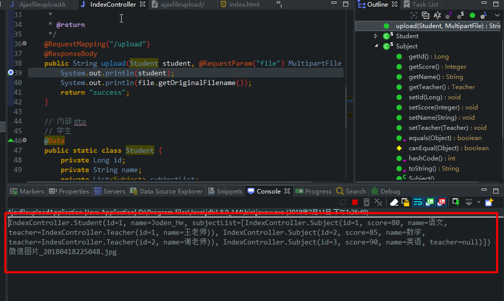

# ajaxfileupload-with-params
ajax 文件上传带参数，spring mvc，支持复杂参数

## 介绍

> 由于 `spring boot` 集成了 `spring MVC` ，因此本文使用了 `spring boot` 去演示该例子。
>
> 支持复杂参数传输

## 实现思路

1. 先对将参数转换成 `input` 标签隐藏在 `form` 表单中；
2. 使用 `ajax` 模拟表单提交;
3. spring MVC 后台接收数据解析。

## 实现效果图

